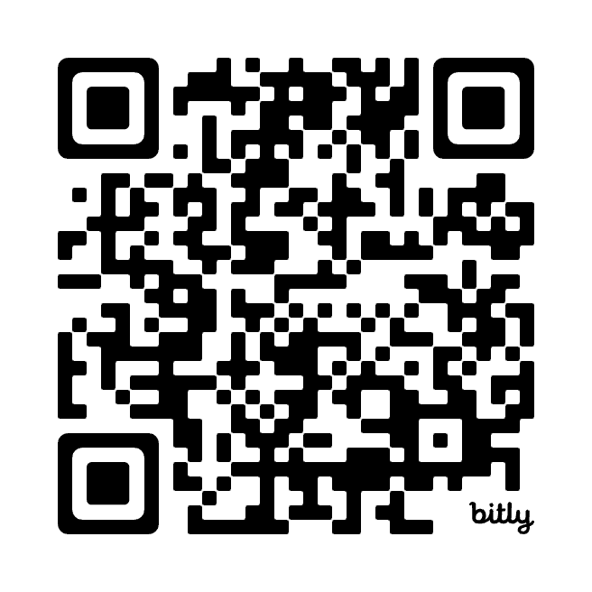

# 📘 SOPs - Edificio Porvenir 45

Este repositorio contiene los **Procedimientos Operativos Estándar (SOPs)** del **Edificio Porvenir 45** en Barranquilla. Su objetivo es organizar y documentar los procesos clave para la administración, propietarios e inquilinos.

---

## 📂 Estructura del repositorio

### 🔹 **[`sops/`](./sops/)** → Procedimientos Operativos Estándar (SOPs)
- 📦 **[SOP-001 - Gestión de Mudanzas](./sops/SOP-001-mudanzas.md)** → Procedimientos para coordinar y realizar mudanzas de manera ordenada y segura, incluyendo horarios y permisos necesarios.
- 🚨 **[SOP-002 - Reporte de Incidentes](./sops/SOP-002-reporte-incidentes.md)** → Instrucciones para reportar y documentar cualquier incidente ocurrido en el edificio, desde accidentes hasta problemas de mantenimiento.
- 🔑 **[SOP-003 - Control de Accesos](./sops/SOP-003-control-de-accesos.md)** → Normas para el ingreso de residentes, visitantes y proveedores.
- 🏢 **[SOP-004 - Solicitud de Reservas de Áreas Comunes](./sops/SOP-004-solicitud-reservas-areas-comunes.md)** → Proceso para reservar salón social, parqueaderos, BBQ, etc.
- 📜 **[SOP-005 - Normas de Convivencia](./sops/SOP-005-normas-convivencia.md)** → Reglas generales sobre ruidos, mascotas, basuras, etc.
- 🔧 **[SOP-006 - Plan de Mantenimiento Preventivo](./sops/SOP-006-plan-mantenimiento-preventivo.md)** → Revisiones programadas de ascensores, bombas de agua, luces, etc.
- 🚨 **[SOP-007 - Gestión de Emergencias y Evacuaciones](./sops/SOP-007-gestion-emergencias-evacuaciones.md)** → Protocolo ante incendios, terremotos, fugas de gas, etc.
- 🎥 **[SOP-008 - Seguridad y Monitoreo CCTV](./sops/SOP-008-seguridad-monitoreo-cctv.md)** → Procedimientos para el uso de cámaras de seguridad y protección de datos.

---

### 📄 **[`docs/`](./docs/)** → Documentación general del edificio
- 📜 **[Reglamento del Edificio](./docs/reglamento.md)** → Normas internas que rigen la convivencia y el uso de las instalaciones.
- 📞 **[Información de Contacto](./docs/contacto.md)** → Datos de la administración, seguridad, emergencias y servicios del edificio.
- 🛠 **[Plan de Mantenimiento](./docs/mantenimiento.md)** → Fechas y actividades programadas para el mantenimiento del edificio.

---

### 📑 **[`formatos/`](./formatos/)** → Plantillas y formatos útiles
- 📄 **[Formato de Solicitud de Mudanza](./formatos/solicitud-mudanza.pdf)** → Documento para solicitar autorización de mudanza ante la administración.

---

### 📂 🌐 **Espacio Virtual para Gestión de Archivos**
📌 **Google Drive (Acceso Restringido a Personal Autorizado)**  
🔗 **[Acceder al Repositorio de Archivos](https://drive.google.com/drive/folders/1oBmfMgf-7GfwiBHxz8_Fd0PS-xbZfVB8?usp=drive_link)**  

---

### 📢 Reporte de Incidentes

Para mejorar la seguridad y el bienestar de todos los residentes del **Edificio Porvenir 45**, hemos habilitado un formulario en línea para reportar incidentes de manera rápida y efectiva.

📌 **¿Cuándo reportar un incidente?**  
Si has presenciado o sido afectado por alguna de las siguientes situaciones:  
✅ **Fallas en servicios** (agua, luz, ascensores, etc.).  
✅ **Problemas de seguridad** (robos, vandalismo, accesos no autorizados).  
✅ **Ruido excesivo o molestias** en horarios de descanso.  
✅ **Daños en infraestructura** (paredes, puertas, iluminación, etc.).  
✅ **Conflictos entre residentes** o violaciones a las normas de convivencia.  

⚠ **Para emergencias inmediatas, comunícate directamente con la portería o administración.**  

📝 **Para realizar un reporte, completa el siguiente formulario:**  

  

📢 **Tu reporte es clave para mantener un edificio seguro y en armonía. ¡Gracias por tu colaboración!**  

---

📌 **Para sugerencias o mejoras, por favor abre un [Issue](https://github.com/tuusuario/edificio-porvenir45-sops/issues).**

---

### 🎯 Beneficios de esta Gestión Documental

✅ **Centralización de documentos**: Todos los SOPs estarán organizados en un solo lugar.  
✅ **Fácil acceso**: La administración, propietarios y operativos pueden consultar procedimientos en línea.  
✅ **Estandarización**: Cada SOP sigue un mismo formato, evitando confusión.  
✅ **Versionado y actualizaciones**: Puedes rastrear cambios y mejorar procesos con el tiempo.  
