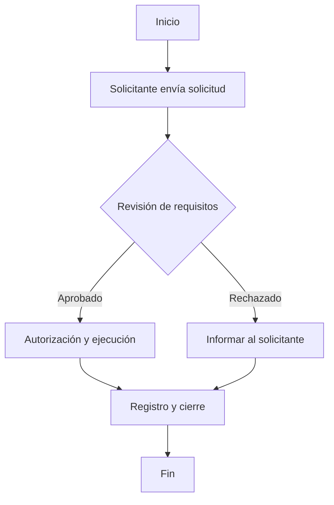

Aquí tienes un **template base para todos los SOPs** del **Edificio Porvenir 45**. Este documento servirá como guía para estructurar y estandarizar cada proceso operativo.  

---

# **PLANTILLA BASE - PROCESOS OPERATIVOS ESTÁNDAR (SOP)**  
📌 **Código**: SOP-XXX _(Asignar un código único para cada SOP: SOP-001, SOP-002, etc.)_  
📌 **Versión**: X.X _(Ejemplo: 1.0, 1.1 para revisiones, etc.)_  
📌 **Fecha de emisión**: DD/MM/AAAA  
📌 **Responsable**: _(Nombre del área o persona encargada del proceso)_  
📌 **Aprobado por**: _(Persona o cargo que aprueba el SOP)_  

---

## **1. Objetivo**
_(Definir de manera clara el propósito del SOP y qué problema soluciona. Debe ser conciso y fácil de entender.)_  

Ejemplo:  
> Establecer un procedimiento estándar para la gestión de mudanzas en el Edificio Porvenir 45, asegurando organización, cumplimiento de normativas y una adecuada comunicación entre propietarios, administración y personal operativo.  

---

## **2. Alcance**
_(Definir quiénes deben seguir este procedimiento y a qué actividades o situaciones aplica.)_  

Ejemplo:  
✅ **Propietarios e inquilinos**  
✅ **Administración del edificio**  
✅ **Personal de portería y seguridad**  

---

## **3. Responsabilidades**
_(Definir claramente qué función tiene cada actor dentro del proceso. Se debe ser específico sobre las tareas que debe cumplir cada uno.)_  

Ejemplo:  
### **3.1 Propietarios e inquilinos**  
- Notificar con anticipación cualquier solicitud relacionada.  
- Cumplir con los requisitos previos al proceso.  

### **3.2 Administración del edificio**  
- Gestionar y aprobar solicitudes.  
- Informar sobre los requisitos y normas.  

### **3.3 Personal operativo y de seguridad**  
- Verificar la documentación y permisos.  
- Registrar cualquier incidencia durante el proceso.  

---

## **4. Procedimiento**
_(Explicar paso a paso cómo debe ejecutarse el proceso. Cada paso debe ser numerado y contener una descripción clara.)_  

### **Paso 1: Solicitud del servicio/proceso**  
📌 **Responsable**: _(Quién debe hacer la acción)_  
📌 **Acción**: _(Qué debe hacer)_  
📌 **Medio**: _(Cómo debe hacerlo: email, formulario, WhatsApp, etc.)_  

### **Paso 2: Validación de requisitos**  
📌 **Responsable**: _(Quién revisa la solicitud y verifica cumplimiento)_  
📌 **Acción**: _(Qué debe revisar y qué pasa si se cumplen/no se cumplen los requisitos)_  

### **Paso 3: Aprobación y ejecución del proceso**  
📌 **Responsable**: _(Quién emite la autorización o realiza la acción)_  
📌 **Acción**: _(Detalles del procedimiento, tiempos y condiciones)_  

### **Paso 4: Registro y cierre del proceso**  
📌 **Responsable**: _(Quién debe cerrar el proceso y documentarlo)_  
📌 **Acción**: _(Qué información se debe guardar y dónde)_  

---

## **5. Diagrama de Flujo**
_(Usar una representación gráfica del proceso en formato **Mermaid** para facilitar la comprensión. Reemplazar los nombres según el proceso específico.)_  

---

## **6. Excepciones y Casos Especiales**
_(Aquí se definen las condiciones bajo las cuales el procedimiento podría cambiar o requerir una revisión especial.)_  

Ejemplo:  
- **Casos urgentes**: Revisión especial en menos de 24 horas.  
- **Casos excepcionales**: Aprobación directa por parte de la administración.  

---

## **7. Control y Actualización**
_(Definir cada cuánto se revisará el SOP para mejorarlo o actualizarlo.)_  

📌 **Frecuencia de revisión**: _(Ejemplo: Cada 6 meses)_  
📌 **Última revisión**: _(Fecha de la última actualización)_  
📌 **Próxima revisión**: _(Fecha estimada de la próxima revisión)_  

---

### **Conclusión**
Este **SOP** proporciona un marco estructurado y estandarizado para garantizar que los procedimientos en el **Edificio Porvenir 45** se ejecuten de manera eficiente, organizada y conforme a las normativas internas.  

Si necesitas ajustes o versiones específicas para otros procesos, dime y lo estructuramos. 🚀
