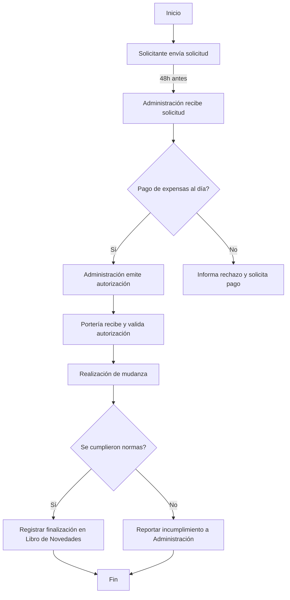

Aquí tienes el primer **Proceso Operativo Estándar (SOP)** para la **gestión de mudanzas** en el **Edificio Porvenir 45**. Este documento servirá como referencia para futuras normativas y procesos, asegurando claridad y eficiencia en la administración.  

---

# **PROCESO OPERATIVO ESTÁNDAR (SOP) - GESTIÓN DE MUDANZAS**  
📌 **Código**: SOP-001  
📌 **Versión**: 1.0  
📌 **Fecha de emisión**: 6 de febrero de 2025  
📌 **Responsable**: Administración del Edificio Porvenir 45  
📌 **Aprobado por**: Martha Romero Senior  

---

## **1. Objetivo**
Establecer un procedimiento claro y eficiente para la autorización y ejecución de mudanzas dentro del **Edificio Porvenir 45**, garantizando el orden, la seguridad y la correcta comunicación entre la administración, propietarios, inquilinos y personal operativo.  

---

## **2. Alcance**
Este procedimiento aplica a:  
✅ **Propietarios e inquilinos** que deseen realizar una mudanza dentro o fuera del edificio.  
✅ **Administración del edificio**, responsable de autorizar y gestionar solicitudes.  
✅ **Personal de portería y seguridad**, encargado de verificar autorizaciones y facilitar el proceso.  

---

## **3. Responsabilidades**
### **3.1 Propietarios e inquilinos**
- Notificar la mudanza con anticipación a la administración.  
- Estar al día con los pagos de expensas comunes.  
- Respetar los horarios establecidos.  
- Cumplir con las normas de convivencia durante la mudanza.  

### **3.2 Administración del edificio**
- Recibir y gestionar solicitudes de mudanza.  
- Verificar el estado de pagos del solicitante.  
- Emitir la autorización formal al personal de portería.  

### **3.3 Personal de portería y seguridad**
- Verificar la autorización de mudanza.  
- Controlar el ingreso y salida de objetos.  
- Registrar cualquier incidencia y reportarla a la administración.  

---

## **4. Procedimiento**
### **Paso 1: Solicitud de mudanza**
📌 **Responsable**: Propietario/Inquilino  
📌 **Acción**: Enviar solicitud a la administración con mínimo **48 horas de anticipación**.  

📍 **Canales habilitados**:  
- Correo electrónico: **edificioporvenir45@gmail.com**  
- WhatsApp de la administración: **[Número a definir]**  
- Carta física en la oficina administrativa  

📌 **Datos obligatorios en la solicitud**:  
1. Nombre del solicitante  
2. Apartamento/Lote  
3. Fecha y horario deseado  
4. Contacto del responsable de la mudanza  

---

### **Paso 2: Verificación de pagos**
📌 **Responsable**: Administración  
📌 **Acción**: Revisar el estado de cuenta del solicitante en un plazo de **24 horas**.  

✅ **Si está al día** → Proceder con la autorización.  
❌ **Si tiene deuda pendiente** → Informar al solicitante y retener la autorización hasta el pago.  

---

### **Paso 3: Emisión de autorización**
📌 **Responsable**: Administración  
📌 **Acción**: Enviar autorización oficial a la portería y al solicitante.  

📍 **Contenido de la autorización**:  
- Nombre del solicitante  
- Fecha y hora aprobada  
- Firma y sello de la administración  

📌 **Medios de entrega**:  
✅ Correo electrónico  
✅ WhatsApp  
✅ Copia impresa en portería  

---

### **Paso 4: Ejecución de la mudanza**
📌 **Responsable**: Propietario/Inquilino + Personal de portería  
📌 **Acción**: Realizar la mudanza en los horarios permitidos.  

📍 **Normas clave**:  
- Prohibido obstruir áreas comunes.  
- Cuidar las instalaciones y ascensores.  
- No exceder los horarios establecidos.  

Si se incumplen normas → **Personal de portería reportará a la administración**.  

---

### **Paso 5: Cierre y registro**
📌 **Responsable**: Personal de portería  
📌 **Acción**: Registrar la finalización de la mudanza en el **Libro de Novedades**.  

📍 **Datos registrados**:  
- Fecha y hora de finalización  
- Observaciones (incidentes, daños, etc.)  
- Firma del encargado de la portería  

---

## **5. Diagrama de Flujo**
Este diagrama resume el proceso en una estructura clara y visual:  

---

## **6. Excepciones y Casos Especiales**
🚨 **Mudanza de emergencia**:  
Si un residente debe mudarse por una **emergencia** (desalojo, seguridad, fuerza mayor), la administración evaluará el caso para permitir una excepción.  

🚨 **Mudanza en domingo**:  
Solo permitida si es aprobada previamente por la administración bajo justificación válida.  

---

## **7. Control y Actualización**
📌 **Frecuencia de revisión**: Cada 6 meses.  
📌 **Última revisión**: 6 de febrero de 2025.  
📌 **Próxima revisión**: 6 de agosto de 2025.  

---

### **Conclusión**
Este SOP establece un proceso claro, estructurado y eficiente para la gestión de mudanzas en el **Edificio Porvenir 45**. La correcta implementación mejorará la comunicación entre propietarios, administración y personal operativo, asegurando orden y cumplimiento de normativas.  
