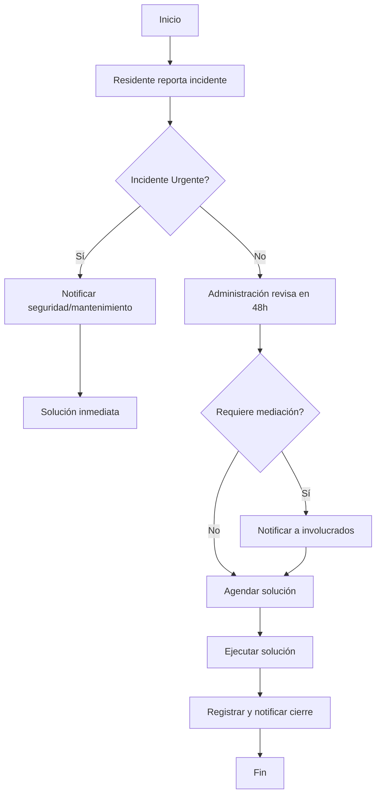

### **📘 SOP-002 - Reporte de Incidentes**  

📌 **Código**: SOP-002  
📌 **Versión**: 1.0  
📌 **Fecha de emisión**: 06/02/2025  
📌 **Responsable**: Administración del Edificio  
📌 **Aprobado por**: Martha Romero Senior  

---

## **1. Objetivo**  
Establecer un procedimiento claro para el **registro, evaluación y resolución de incidentes** en el **Edificio Porvenir 45**, garantizando una gestión organizada y una respuesta oportuna por parte de la administración.  

---

## **2. Alcance**  
Este procedimiento aplica a:  
✅ **Propietarios e inquilinos** que deseen reportar incidentes dentro del edificio.  
✅ **Administración del edificio**, encargada de gestionar y resolver incidentes.  
✅ **Personal de seguridad y mantenimiento**, responsable de verificar y documentar incidentes operativos.  

---

## **3. Definición de Incidente**  
Se considera incidente cualquier **evento inesperado** que afecte la seguridad, el bienestar o el funcionamiento del edificio, incluyendo:  
🔹 **Fallas en servicios** (ascensores, agua, electricidad, etc.).  
🔹 **Problemas de seguridad** (robos, vandalismo, accesos no autorizados).  
🔹 **Inconvenientes entre residentes** (ruidos excesivos, disputas).  
🔹 **Daños en infraestructura** (paredes, pisos, cerraduras, etc.).  

---

## **4. Procedimiento**  

### **Paso 1: Reporte del incidente**  
📌 **Responsable**: Residente o personal del edificio  
📌 **Acción**: Enviar reporte de incidente a la administración.  

📍 **Canales habilitados**:  
- **Correo electrónico**: `edificioporvenir45@gmail.com`  
- **WhatsApp de la administración**: `[Número a definir]`  
- **Formato físico**: Disponible en la oficina administrativa  

📌 **Datos obligatorios en el reporte**:  
1️⃣ Nombre del reportante  
2️⃣ Ubicación del incidente (apartamento, área común, etc.)  
3️⃣ Descripción del incidente  
4️⃣ Fecha y hora del suceso  
5️⃣ Evidencia (fotos/videos, si aplica)  

---

### **Paso 2: Evaluación y asignación**  
📌 **Responsable**: Administración del edificio  
📌 **Acción**: Revisar la información y determinar el tipo de incidente.  

✅ **Si es urgente** → Notificar al personal de seguridad/mantenimiento de inmediato.  
✅ **Si es administrativo** → Agendar revisión y solución dentro de **48 horas**.  
✅ **Si requiere mediación** → Notificar a las partes involucradas para una resolución conjunta.  

---

### **Paso 3: Resolución y seguimiento**  
📌 **Responsable**: Administración + Seguridad/Mantenimiento  
📌 **Acción**: Ejecutar la solución y notificar el cierre del incidente.  

📍 **Registro de resolución**:  
- Fecha de solución  
- Medidas tomadas  
- Responsable del cierre  
- Notificación al reportante  

---

## **5. Diagrama de Flujo**  

---

## **6. Excepciones y Casos Especiales**  
🚨 **Incidentes de seguridad** → Notificación inmediata a seguridad privada y posible escalamiento a la policía.  
🚨 **Reclamos entre residentes** → Mediación por parte de la administración con normativa de convivencia.  

---

## **7. Control y Actualización**  
📌 **Frecuencia de revisión**: Cada **6 meses**.  
📌 **Última revisión**: 06/02/2025.  
📌 **Próxima revisión**: 06/08/2025.  

---

## **📌 Mejoras para Próximas Versiones (2.0)**
🔹 Implementar un **formulario digital** para reportes en línea.  
🔹 Crear un **dashboard de incidentes** para visualizar estatus y tiempos de respuesta.  
🔹 Agregar categorías más detalladas para clasificación de incidentes.  
🔹 Establecer **tiempos de respuesta específicos** según tipo de incidente.  
🔹 Integración con una **plataforma de tickets** para seguimiento automatizado.  

---

### ✅ **Conclusión**  
Este SOP establece un proceso estandarizado para la gestión de incidentes en el **Edificio Porvenir 45**, asegurando **orden, trazabilidad y respuesta efectiva**. A medida que se implemente, se podrán **agregar mejoras** para optimizar tiempos y comunicación.  
